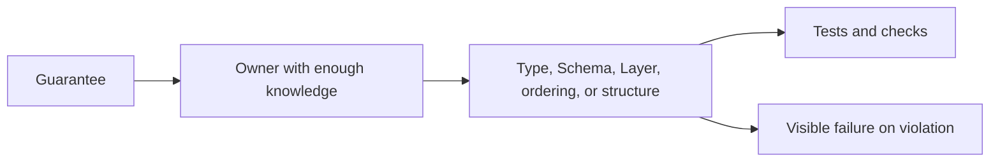
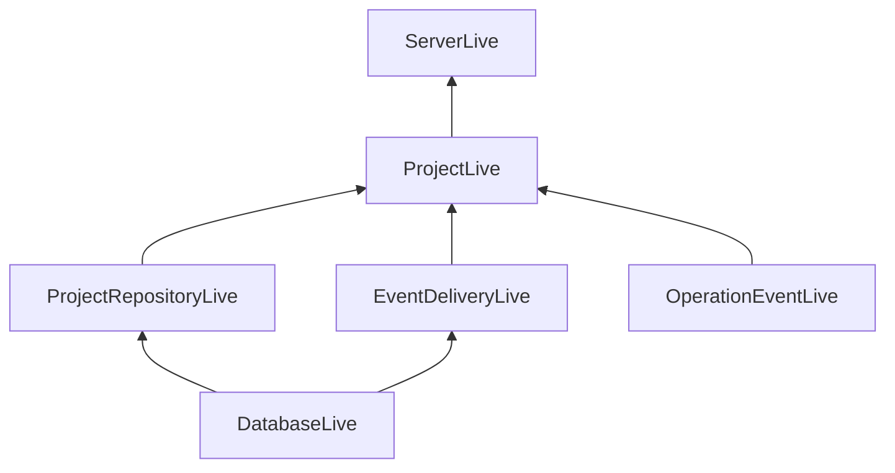
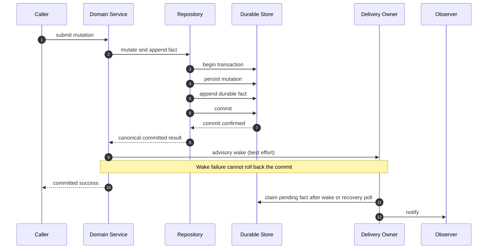
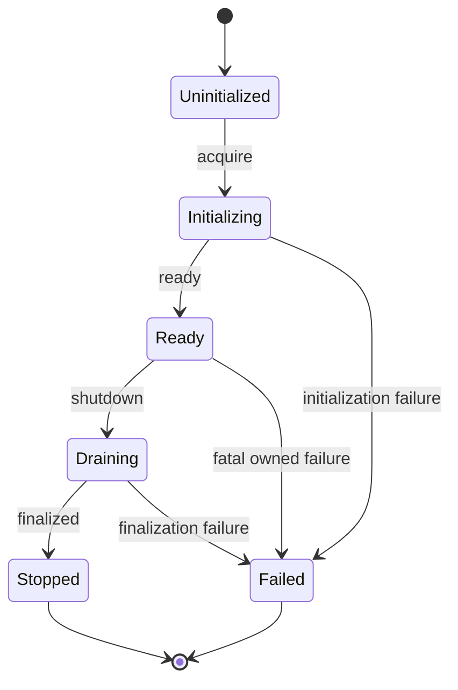
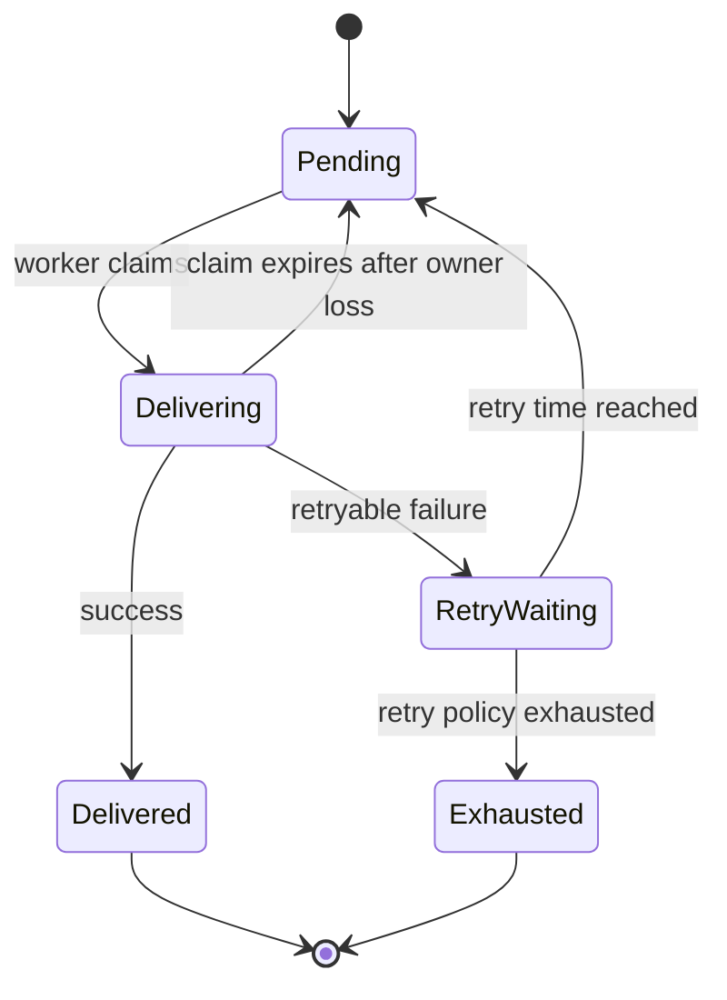
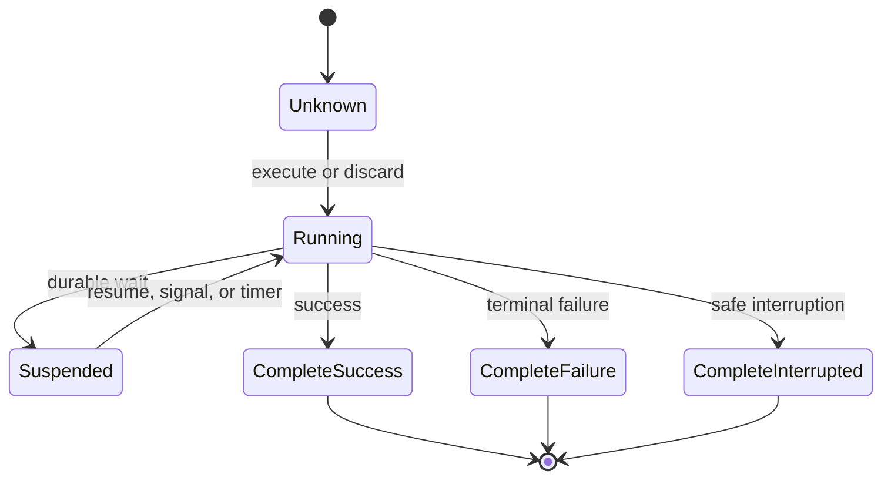
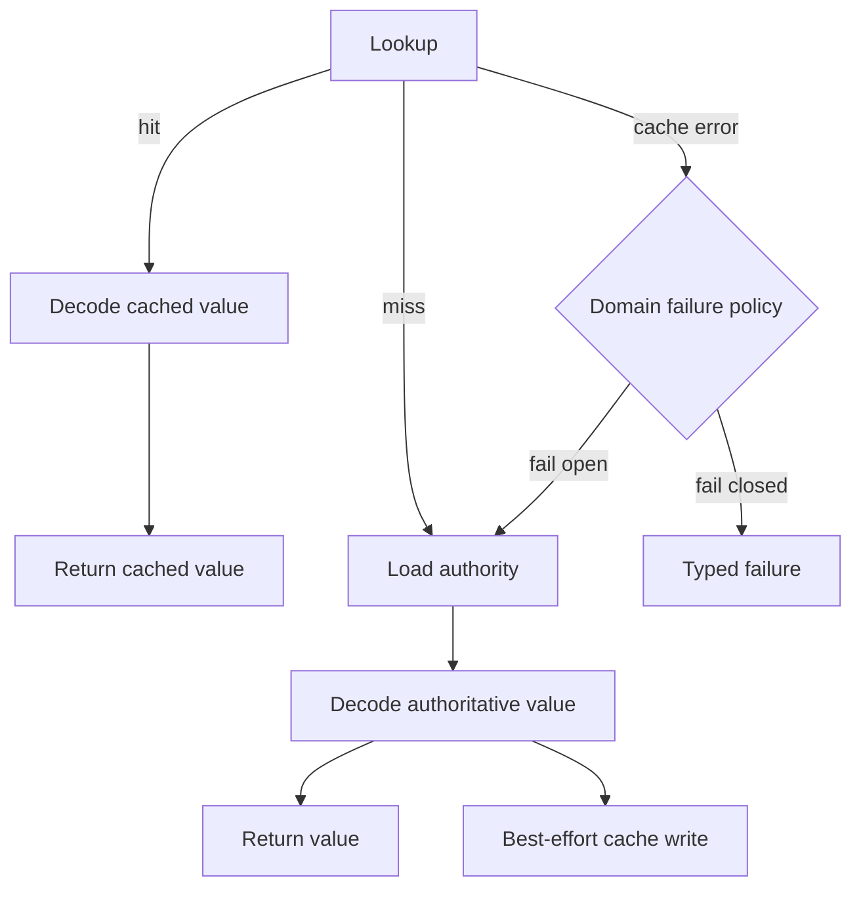

# Effect-First Backend Engineering Quality Standard

Status: Internal RFC-Style Specification  
Version: 1.1-draft  
Date: 2026-08-30

## Abstract

This document specifies an Effect-first quality standard for backend systems
written in TypeScript.  It defines how implementations represent values,
dependencies, failures, resources, concurrency, persistence, streams,
workflows, caching, observability, transport boundaries, and tests.  The
standard favors explicit guarantees and contextual engineering review over
mechanical conformity.  It reserves absolute requirements for correctness,
security, compatibility, and lifecycle properties whose violation can cause
harm.  It also provides decision guidance for architectural choices that
depend on domain semantics and operating constraints.

## Status of This Memo

This document defines an internal engineering standard.  It is not an
Internet Standards Track specification, an Internet-Draft, or a published
Request for Comments (RFC).  It uses RFC structure, terminology, and editorial
conventions from RFC 7322 [RFC7322] to make its requirements precise and
reviewable.

Distribution of this memo is unlimited within the organization that adopts
it.

## Table of Contents

1. Introduction
2. Requirements Language
3. Scope and Audience
4. Terminology
5. Quality Model
6. Source and Language Conventions
7. Schema and Data Representation
8. Functions, Namespaces, and Services
9. Layers and Composition
10. Errors, Causes, and Interruption
11. Persistence, Transactions, and Events
12. Concurrency and Resource Ownership
13. Streams and Backpressure
14. Durable Workflows and Background Work
15. Caching
16. Configuration and External Adapters
17. Observability and Wide Events
18. Transport Boundaries
19. Testing
20. Code Organization and Documentation
21. Out-of-Specification Behavior
22. Options and Extension Points
23. Scalability and Stability Considerations
24. Operational Management Considerations
25. IANA Considerations
26. Internationalization Considerations
27. Security Considerations
28. References
Appendix A. Requirements Summary
Appendix B. Non-Exhaustive State-Machine Sketches
Appendix C. Non-Normative Examples
Appendix D. Decision History
Appendix E. Change Log

## 1. Introduction

Effect [EFFECT] provides types and runtime structures for dependencies,
expected failures, resource scopes, concurrency, interruption, streams,
scheduling, and observability.  Those structures improve quality only when
the codebase assigns each guarantee to a clear owner and tests the behavior
that callers actually depend upon.

This document specifies an engineering model in which:

* Schema owns runtime representations and transformations.
* Services represent real capabilities, dependencies, shared state, or
  lifecycle.
* Layers construct adapters and own their resources.
* Composition roots establish hierarchy, sharing, and isolation.
* Repositories expose intentional persistence operations.
* Expected failures remain typed.
* Durable state commits before advisory notification.
* Concurrent and background work has a lifecycle owner.
* Wide events collect typed facts and emit once per lifecycle.
* Tests prove guarantees through production seams.

The objective is not to maximize the amount of Effect code.  The objective is
to make failure, dependency, ordering, concurrency, resource, and lifecycle
semantics explicit where those semantics affect correctness or operation.

### 1.1. Specification Philosophy

This document follows the clarity guidance of RFC 2360 [RFC2360].  A
requirement is stated strongly only when a weaker interpretation can violate a
contract, compromise security, corrupt data, leak resources, or destabilize
the system.  Architectural preferences that depend on local context are
presented as review decisions rather than universal rules.

Examples are illustrative.  An implementation can differ from an example
while satisfying the requirement that the example demonstrates.

### 1.2. Document Organization

Sections 6 through 20 specify the engineering model.  Sections 21 and 22
define behavior outside the model and optional mechanisms.  Sections 23
through 27 discuss operational and publication considerations.  The
appendices summarize requirements, state machines, examples, and decision
history.

## 2. Requirements Language

The key words "MUST", "MUST NOT", "REQUIRED", "SHALL", "SHALL NOT",
"SHOULD", "SHOULD NOT", "RECOMMENDED", "NOT RECOMMENDED", "MAY", and
"OPTIONAL" in this document are to be interpreted as described in BCP 14
[RFC2119] [RFC8174] when, and only when, they appear in all capitals, as shown
here.

Lowercase uses of these words have their normal English meanings and are not
normative.  BCP 14 terms are used sparingly.  A `SHOULD` or `SHOULD NOT`
allows a valid exception only when the implementation understands and reviews
the consequences of the alternative.

Review prompts and examples are non-normative unless a section explicitly
states otherwise.

## 3. Scope and Audience

### 3.1. Scope

This specification applies to TypeScript backend components that use Effect
v4, including:

* HTTP and RPC servers;
* workers and scheduled jobs;
* event producers and consumers;
* command-line and operational programs;
* persistence, cache, process, filesystem, and SDK adapters; and
* shared backend libraries that coordinate effectful work.

### 3.2. Audience

The intended audience includes backend implementers, library maintainers,
reviewers, platform engineers, and engineers responsible for reliability,
security, and testing.

### 3.3. Non-Goals

This document does not specify:

* frontend architecture or visual design;
* a universal directory tree;
* automated architecture enforcement;
* a specific database, cache, queue, telemetry vendor, or deployment system;
* universal retry counts, timeouts, concurrency limits, or cache lifetimes;
* mandatory historical database fixtures for every migration; or
* migration to the newest Effect release independently of project needs.

This document does not require Effect for pure, local data transformations
that do not need an Effect failure, dependency, cancellation, or lifecycle
contract.

### 3.4. Applicability

The requirements apply when their stated preconditions hold.  For example,
workflow replay requirements apply only to durable Workflow implementations,
and distributed cache representation requirements apply only to remote or
persistent caches.

Code review remains responsible for determining whether a precondition holds
and whether the selected mechanism protects the intended guarantee.

## 4. Terminology

**Adapter**: An implementation that translates an external, platform, vendor,
or persistence interface into a project-owned capability.

**Boundary**: A location where data, errors, control, or lifetime crosses
between trust domains, representations, runtimes, or owners.

**Capability**: An operation or family of operations made available through an
explicit Effect requirement or function contract.

**Composition root**: The module that selects concrete adapters, establishes
their hierarchy, and produces an executable Layer with no unsatisfied
requirements.

**Defect**: An unexpected failure that represents an implementation fault or
broken invariant rather than an expected operational outcome.

**Domain fact**: A typed record that states something that has occurred in the
domain.  A durable fact is committed to authoritative storage.

**Effect-first**: An architecture in which dependencies, expected failures,
resources, cancellation, and concurrency are represented explicitly through
Effect values and their environment.

**Layer**: A managed constructor for one or more capabilities, including their
dependencies, acquisition failures, and finalizers.

**Lifecycle owner**: The Service, Scope, worker, runtime, or request that is
responsible for starting, observing, interrupting, and finalizing work.

**Operation event**: A typed, context-rich event emitted once for a request,
job, workflow, or comparable lifecycle.  This is also called a wide event or
canonical log line.

**Port**: A project-owned capability contract whose adapters can vary.

**Repository**: A persistence capability that exposes intentional operations
in domain vocabulary and hides storage representation and transaction
mechanics.

**Review decision**: A contextual choice that must be evaluated against its
guarantee, owner, operational consequences, and evidence.  It is not a hard
rule.

**Schema**: An executable runtime contract for decoding, validating,
transforming, and encoding data.

**Typed failure**: An expected failure represented in the Effect error
channel.

**Wide event**: See Operation event.

## 5. Quality Model

### 5.1. Quality Verticals

A quality vertical is a guarantee that crosses the layers required to make it
true.  Each critical vertical should identify:

* the guarantee;
* the owner that first has enough knowledge to enforce it;
* the type, Schema, Layer, ordering, or structure that enforces it;
* the tests or checks that provide evidence; and
* the visible failure produced by a violation.

The principal verticals are:

1. Input validity.
2. Domain integrity and module depth.
3. Explicit dependencies.
4. Failure semantics.
5. Effect ordering and consistency.
6. Lifecycle and concurrency ownership.
7. Adapter discipline.
8. Test seam fidelity.
9. Observability without instrumentation noise.
10. Change locality.

Quality is replicable when a guarantee has an owner, enforcement, and
evidence.  High quality in one vertical does not compensate for a critical,
unowned guarantee in another vertical.

The following diagram shows the review shape of one quality vertical.  The
implementation mechanism makes the guarantee enforceable, while evidence and
visible failure make violations reviewable and operationally apparent.



### 5.2. Requirement Strength

The specification distinguishes:

* invariants required for safety, correctness, or compatibility;
* recommended defaults with known exceptions;
* review decisions whose answer depends on domain and operating constraints;
  and
* examples that demonstrate one valid implementation.

Reviewers SHOULD identify the concrete failure mode or maintenance pressure
behind a recommendation.  Reviewers SHOULD NOT reject code solely because it
differs from an example or preferred Effect idiom.

## 6. Source and Language Conventions

### 6.1. Installed Effect Version

Implementations MUST use APIs provided by the Effect version pinned by the
project dependency manifest and lockfile.  Reviews MUST NOT require an API
that is absent from that version.

When API behavior is uncertain, engineers SHOULD inspect sources in this
order:

1. the project manifest and lockfile;
2. the installed package source and declarations;
3. the exact matching upstream source and tests;
4. migration notes for the installed version; and
5. project-local usage.

A project MAY maintain a squashed Git subtree at `./.repos/effect` for
read-only exploration of the exact upstream release.  Such a subtree MUST NOT
be imported by production code or included in application workspaces,
builds, formatting, linting, or publication.  Package manifests and the
lockfile remain the dependency authority.

### 6.2. Language

This standard uses English for source code, identifiers, TSDoc, inline
comments, error tags, and test descriptions.  User-facing text is outside this
convention and may be localized.

### 6.3. Formatting and Comments

Automated formatting owns mechanical layout.  Documentation comments should
follow TSDoc [TSDOC].  Inline comments should be rare and should explain a
local invariant or rationale that naming and structure cannot express.

An interruptibility override, freshness boundary, unusual retry, or subtle
settlement check should include an English comment or TSDoc explanation of
its rationale.

## 7. Schema and Data Representation

### 7.1. Boundary Decoding

Unknown, untrusted, transported, configured, persisted, cached, or workflow-
persisted data MUST be decoded by Schema before domain logic relies on it.
Type assertions MUST NOT substitute for runtime decoding at such a boundary.

An implementation MUST preserve the distinction between:

* type-side construction, such as `schema.makeEffect(value)`; and
* encoded-side decoding, such as `Schema.decodeUnknownEffect(schema)(input)`.

Synchronous `schema.make(value)` MAY be used for constants or values whose
invalidity is an implementation defect.  Effectful workflows SHOULD use
`makeEffect` or boundary decoding so failures remain typed.

### 7.2. Canonical Representations

Each representation boundary SHOULD have one canonical Schema and one
canonical transformation path.  Ad hoc conditionals MUST NOT create a second,
competing representation of the same boundary contract.

Distinct representations MAY have distinct Schemas when they have distinct
owners.  For example, `Project.Info` can represent a domain value while
`StoredProject` represents a SQL row.  Their relationship SHOULD be expressed
with a Schema transformation.

Ephemeral state assembled only from already decoded values does not require a
Schema unless runtime validation protects a concrete invariant.

### 7.3. Patch Semantics

Patch fields SHOULD use one platform-wide tri-state convention where the
domain requires unchanged, clear, and set states.  A typical convention is:

* `undefined`: do not change the field;
* `null`: clear the field; and
* a value: set the field.

Global repair logic MUST NOT remove or rewrite values, such as `null`, without
Schema knowledge.  A value accepted by the selected Schema branch MUST be
preserved.

### 7.4. Branded Values

Brands SHOULD represent domain identity or validated scalar invariants.
Branding alone does not add runtime validation; the underlying Schema MUST
encode required checks.

## 8. Functions, Namespaces, and Services

### 8.1. Functions

A function should represent one operation or decision that can be described
as a verb phrase without unrelated responsibilities.  Line count alone does
not determine responsibility.

Direct delegations SHOULD remain inline:

```ts
return Service.of({
  list: () => repository.list()
})
```

A named function or namespace operation is appropriate when it introduces
domain vocabulary, removes representation knowledge from callers, or defines
an independently testable decision.  Functions that only rename library calls
or narrate a sequence SHOULD NOT be extracted.

### 8.2. Namespaces

Namespaces SHOULD be named after a domain owner, representation, or
capability, such as `WorkspacePath`, `ProjectRepository`, or `CacheStore`.
Generic `Helper`, `Utils`, and `Common` namespaces SHOULD NOT be used when a
more precise owner exists.

The threshold for a namespace is semantic.  A namespace MAY contain one
operation when that operation owns a stable concept.  A minimum function
count is not required.

### 8.3. Services

A Service SHOULD be introduced when at least one of the following is
material:

* callers require an external or replaceable capability;
* operations share state or dependencies;
* lifecycle must be owned centrally;
* multiple adapters are useful;
* callers should not choose sequencing or implementation details; or
* substitution at the Service seam materially improves tests or runtime
  composition.

A Service SHOULD NOT be created solely because a function returns an Effect
or can be mocked.  Pure transformations should remain functions or namespace
operations.

Within a qualified namespace, the capability contract SHOULD be named
`Interface` and the Context tag SHOULD be named `Service`:

```ts
export interface Interface {
  readonly update: (
    input: UpdateInput
  ) => Effect.Effect<Info, UpdateError>
}

export class Service
  extends Context.Service<Service, Interface>()(
    "@app/Project"
  ) {}
```

### 8.4. Effect Function Forms

Implementations SHOULD choose the least ceremonial form that preserves the
required semantics:

* a plain function for direct Effect composition or delegation;
* `Effect.fnUntraced` for reusable internal generator sequencing that does
  not deserve a stack or tracing boundary;
* unnamed `Effect.fn` when an Effect stack frame is useful without a named
  span; and
* named `Effect.fn("Domain.operation")` for meaningful domain, I/O, or
  lifecycle operations whose latency and failure are independently useful.

Named spans SHOULD describe stable domain operations rather than current
mechanics.

### 8.5. Owner-Qualified Construction

A cross-module operation, constructor, or factory SHOULD be exported through
its semantic owner.  A factory that constructs a materially distinct instance
SHOULD use the leaf name `make`; the owner name SHOULD NOT be repeated in that
leaf name.  For example, consumers should call `RenderTransaction.make()`, not
`makeRenderTransaction()`.

The owner can be expressed by a module namespace, a TypeScript namespace, or
another project-standard owner object.  This guidance does not rename APIs
whose established names are controlled by an external platform or library.

A factory is justified when each invocation constructs materially distinct
state, captures configuration or dependencies, establishes identity, or owns
a resource lifecycle.  A stateless collection of operations SHOULD NOT expose
a factory when every invocation produces behaviorally equivalent objects or
closures.  Its operations SHOULD instead be exported directly from the owning
module or namespace:

```ts
import * as RenderTransaction from "./render-transaction.js"

yield* RenderTransaction.replace(request)
yield* RenderTransaction.reconcile(request)
yield* RenderTransaction.cleanup(result)
```

Test isolation alone is not sufficient justification for a factory when no
state, dependency, identity, or lifecycle is isolated.  Likewise, a module
SHOULD NOT introduce a `shared` value solely to bundle stateless operations or
avoid allocating equivalent closures; direct owner-qualified operations are
the simpler representation.

The following table summarizes the naming decision:

| Semantics | Preferred shape |
| --- | --- |
| Stateless operations | `Owner.operation` |
| Factory with distinct state, configuration, dependencies, or identity | `Owner.make` |
| Capability with dependencies or lifecycle | `Owner.Service` |
| Canonical adapter Layer | `Owner.layer` |
| Singleton whose shared identity is semantically material | `Owner.shared` or a domain-specific noun |

## 9. Layers and Composition

### 9.1. Layer Construction

A module Layer SHOULD construct one canonical adapter and leave its required
capabilities visible in the Layer input type.  The module SHOULD NOT select
production adapters for those requirements unless it is itself a composition
root.

Layer construction SHOULD remain together when a separate `make` Effect has
no reuse or independent meaning:

```ts
export const layer = Layer.effect(
  Service,
  Effect.gen(function*() {
    const repository = yield* ProjectRepository.Service
    const update = Effect.fn("Project.update")(function*(input) {
      return yield* repository.update(input)
    })
    return Service.of({ update })
  })
)
```

Mutable state used by an adapter SHOULD be created during Layer construction
so its ownership follows the Layer lifecycle.  Process-global mutable state
requires an explicit owner and review rationale.

### 9.2. Composition Root

Concrete adapters MUST be selected in a composition root or an equivalent
runtime-owned composition module.  An executable root Layer MUST have no
unsatisfied requirements.  Its type SHOULD state `never` explicitly:

```ts
export const ServerLive: Layer.Layer<
  Server.Service,
  ApplicationStartupError,
  never
> = Server.layer.pipe(Layer.provide(DomainLive))
```

The root SHOULD expose only the capabilities required by the executable
program.  `Layer.provide` is the default when a dependency is private.
`Layer.provideMerge` SHOULD be used only when later construction or tests
deliberately consume the provider output.

`Layer.mergeAll` combines sibling outputs; it does not feed one sibling into
another.  Composition MUST use `Layer.provide` or `Layer.provideMerge` when an
output satisfies another Layer requirement.

The arrows below mean that a provider output satisfies a consumer requirement.
Reusing the same `DatabaseLive` Layer value makes the intended database
identity and sharing explicit.



### 9.3. Placement and Sharing

A Layer SHOULD be provided at the lowest composition node that owns all
consumers that must share the same service instance.  Placement decisions
must consider:

* shared identity;
* required lifetime; and
* isolation boundaries such as process, tenant, location, request, and job.

Parameterized resource Layer factories SHOULD be invoked once per intended
resource identity and their resulting Layer value SHOULD be reused.  Repeated
factory calls can create distinct pools, fibers, or caches because Layer
memoization uses Layer object identity.

### 9.4. Freshness

`Layer.fresh` MAY be used when multiple acquisitions of the same Layer
identity represent intentional isolation boundaries.  The name and nearby
documentation SHOULD reveal that intention.  Tests SHOULD prove independent
state and finalization where isolation is important.

Freshness SHOULD NOT be used as a workaround for incorrect composition or
accidental sharing.  Review should require a stated isolation purpose.

### 9.5. Runtime Ownership

`Effect.provide(layer)` owns the Layer for the duration of one Effect.
`Layer.launch(layer)` keeps a daemon-like Layer alive until its returned
Effect is interrupted; the host remains responsible for process-signal
wiring.
`ManagedRuntime` is appropriate only as a lifecycle-owned bridge from a
non-Effect host into a fully provided Effect graph.

`ManagedRuntime` MUST NOT be used:

* inside domain functions;
* inside Effect Service implementations or Effect boundary adapters;
* once per request, operation, or message;
* to erase an inconvenient Effect requirement;
* as a service locator;
* to call Effect from another Effect; or
* to retrieve a service manually from a Layer.

A ManagedRuntime owner MUST dispose it when the host lifecycle ends.  A host
integration module that owns this bridge is not an Effect boundary adapter for
the purpose of the prohibition above.

### 9.6. Custom Layer Graphs

Native Layer composition SHOULD be the initial design.  A custom traversable
graph, such as a system that supports graph-wide late replacements or
partitioned lifecycles, MAY be introduced when concrete runtime profiles and
lifecycle requirements justify its complexity.

## 10. Errors, Causes, and Interruption

### 10.1. Typed Failures

Expected domain, transport, persistence, configuration, and external
operational failures MUST remain in the typed Effect error channel until an
owner deliberately handles or translates them.

Services SHOULD expose precise operation-level error unions when doing so
remains legible.  Domain error unions and infrastructure error unions MAY be
preserved as named groups.  Infrastructure driver details SHOULD NOT leak
through a domain interface unless callers deliberately depend on that
contract.

Yieldable tagged errors SHOULD be used consistently with the installed Effect
version.  Broad classifiers that accept `unknown` and infer error meaning
after the boundary SHOULD NOT replace direct construction or `catchTags` over
known tagged errors.

### 10.2. Defects

Production code SHOULD NOT use `Effect.die` or `Effect.orDie` for an expected
operational failure.  Invalid persisted data is an expected boundary failure
and SHOULD be represented by a typed error such as `Database.InvalidRow`.

Programmer bugs and unexpected throws may remain defects naturally.  Test
adapters MAY use fail-loud defects for methods that must not be called.

### 10.3. Cause Handling

Business recovery MUST operate on the typed error channel unless it
specifically intends to handle defects or interruption.  `catchCause` MUST NOT
turn interruption or defects into ordinary fallback success accidentally.

Cause-level handling is appropriate for terminal reporting, lifecycle
observation, and logic that re-emits the original Cause.

### 10.4. Interruption

Interruption MUST remain observable across adapters, child fibers, streams,
and resource cleanup.  Promise adapters SHOULD pass the `AbortSignal` supplied
by `Effect.tryPromise` when the external API supports cancellation.

`Effect.uninterruptible` and `Effect.uninterruptibleMask` MAY protect a small,
critical region.  Their use SHOULD include a comment explaining the invariant
and SHOULD restore interruptibility around long or external I/O.

## 11. Persistence, Transactions, and Events

### 11.1. Repository Intent

Repositories SHOULD expose intentional operations in domain vocabulary.  A
repository operation MAY own a transaction and durable event append when that
atomic guarantee is part of the operation contract.

The domain Service SHOULD NOT pass an arbitrary Effect into a transaction
capability merely to hide transaction mechanics when an intentional
repository operation can express the complete guarantee more clearly.

A repository adapter SHOULD decode returned rows using the canonical stored
Schema before returning domain values.  Domain Services SHOULD NOT depend on
raw database rows.

### 11.2. Atomicity

When a mutation and a durable fact together define one guarantee, they MUST be
committed atomically or the API MUST explicitly document weaker semantics.

The repository SHOULD derive the durable event from the canonical persisted
result when constructing it earlier could allow contradictory state and event
payloads.

### 11.3. Commit Before Notify

Durable state and durable facts MUST commit before advisory in-process or
external notification.  Notification MUST NOT expose data that can still roll
back.

Notification failure after commit MUST NOT imply that the mutation was rolled
back.  A durable delivery owner SHOULD retry notification from stored facts.
The mutation MAY return success once durable commit completes when
notification is advisory.

The ordering boundary is illustrated below.  The durable store, rather than
the advisory wake signal, is the source from which delivery recovers.



### 11.4. Delivery

Durable delivery SHOULD track enough state to resume after restart, including
attempt count, claim expiry, and next-attempt time when retries are scheduled.
A typical state model is defined in Appendix B.2.

An advisory wake signal MAY reduce delivery latency.  The wake operation
SHOULD be infallible to the committed mutation; the delivery owner records and
recovers its own signaling failure.  The durable event store remains
authoritative.  Recovery polling or startup recovery MUST discover pending
facts if the process terminates after commit and before the wake.

### 11.5. Idempotency and Concurrent Writes

Every public mutation SHOULD define whether it uses last-write-wins,
optimistic concurrency, serialization per key, or idempotent admission.

Operations subject to network retry SHOULD use an idempotency identity from
the admission boundary or another stable natural command identity.  A new
repository-generated event ID does not deduplicate repeated client requests.

### 11.6. Migrations

Migration ownership is a review decision.  When an adapter requires a schema
to be ready during acquisition, its Layer SHOULD complete required migration
or readiness work before providing the Service.

Migrations that transform data MUST decode historical representations through
Schema and MUST NOT use type assertions as a substitute for validation.
Destructive changes SHOULD document deployment and rollback assumptions.
Evidence SHOULD be proportional to semantic risk; SQL syntax success alone
does not prove data preservation.

## 12. Concurrency and Resource Ownership

### 12.1. Structured Ownership

Every forked computation MUST have a lifecycle owner that can observe its
failure, interrupt it, and await finalization.  Domain code MUST NOT create an
orphan daemon fiber.

Work that ends with its caller should remain joined or caller-scoped.  Work
owned by a Service should be supervised by that Service Scope or a structure
such as a FiberSet.  Work that must survive logically beyond a request or
restart should use durable admission and an owned worker or Workflow.

### 12.2. Primitive Selection

Concurrency primitive selection is a review decision.  Reviewers should ask
which policy the primitive encodes:

* Ref for atomic state;
* Deferred for one-shot shared completion;
* Queue for workload and backpressure;
* Semaphore or mutex for exclusion or bounded access; and
* FiberSet or equivalent for supervised work.

The primitive is not merely an implementation detail when it determines
atomicity, overload, ordering, or cancellation.

### 12.3. Single Flight and Locking

Single-flight attempts, locks, Deferred settlement, and waiter interruption
SHOULD remain internal to the Service that owns the operation.  Callers SHOULD
see a semantic method such as `load`, not methods that require them to choose
between starting, joining, or locking.

Authorization SHOULD occur before acquiring contention-sensitive locks unless
authorization itself requires state that can only be read under that lock.

### 12.4. Resource Acquisition

Acquired resources that require release MUST have a structural owner and
finalizer.
`Effect.acquireRelease`, `Effect.acquireUseRelease`, scoped Layers, or an
equivalent Effect resource contract SHOULD define that ownership.

Imperative `try/finally` MAY be used inside a boundary adapter for a native API
that requires explicit cleanup.  The adapter MUST expose a scoped Effect
contract to its callers.

### 12.5. Overload

Queues and stream buffers SHOULD define capacity, overflow strategy,
ordering, shutdown behavior, and failure destination.  Unbounded queues or
unbounded concurrency SHOULD be used only when a concrete external bound or
operational argument makes memory growth safe.

## 13. Streams and Backpressure

### 13.1. Selection

Use of Stream is a review decision.  Stream SHOULD be used when values arrive
over time or when incremental consumption, early termination, cancellation,
resource finalization, backpressure, or temporal composition is part of
correctness.

An Effect containing a materialized collection SHOULD be used when an
operation produces one bounded snapshot or page.  Multiple values and
pagination alone do not require Stream.

### 13.2. Resource Lifetime

A Stream MUST keep resource-backed producers alive for the complete
consumption lifecycle and MUST release them on completion, failure, or
interruption.  In current Effect v4 APIs, `Stream.unwrap` can acquire a
resource and return a Stream within the active stream Scope.

### 13.3. Callback Sources

Callback-backed Streams MUST unregister external listeners when consumption
ends.  Registration SHOULD use scoped acquisition or an explicit finalizer.

`Stream.callback` implementations SHOULD define a finite buffer and overflow
strategy when source rate is not externally bounded.  A synchronous callback
cannot suspend for backpressure.  Implementations MUST handle a failed
synchronous queue offer according to the declared overflow policy rather than
silently ignoring it.

### 13.4. Ordering and Concurrency

Concurrent stream processing SHOULD document whether output ordering matters,
what concurrency limit applies, and what happens when one element fails.
Ordered output does not imply that concurrent side effects execute in order.

## 14. Durable Workflows and Background Work

### 14.1. Workflow Selection

Ordinary Effect composition SHOULD be used for short, process-bound
orchestration.  The Workflow APIs described here are version-sensitive and
are published under `effect/unstable/workflow`; implementations MUST verify
their exact pinned Effect version.  Effect Workflow MAY be used when an
operation requires one or more of:

* progress that survives restart;
* replayed intermediate results;
* durable waits, timers, or callbacks;
* per-step retry;
* compensation;
* durable status and interruption; or
* cross-process idempotent admission.

A queue SHOULD be considered when the work is one independently retryable
background unit and worker throughput is the principal concern.

The Workflow value MAY be the public capability when its execute, poll,
resume, and interrupt operations match application vocabulary.  A Service
facade SHOULD NOT be added only to delegate to those operations.

### 14.2. Replay Safety

External and nondeterministic effects in a durable Workflow MUST be represented
as Activities, durable primitives, or another replay-safe mechanism.  Clock,
randomness, HTTP calls, database writes, and SDK calls MUST NOT run as ordinary
workflow-body effects when replay could repeat or change their result.

Workflow tags, idempotency behavior, activity names, payload Schemas, success
Schemas, and error Schemas are persistence contracts.  Changes to them MUST be
reviewed for compatibility with stored executions.

### 14.3. Activity Delivery Semantics

An Activity with an external side effect MUST be idempotent, deduplicated, or
reconciled explicitly.  Persisted Activity results do not provide universal
exactly-once external delivery because a process can terminate after the
external effect and before result persistence.

Activity retry policy SHOULD be owned by the Activity or durable workflow
runtime that understands its idempotency and persisted attempt identity.

### 14.4. Background Delivery

Fire-and-forget semantics MUST mean durable or supervised handoff to a
lifecycle owner.  It MUST NOT mean an unowned `Effect.forkDetach`.

## 15. Caching

### 15.1. Architecture

Caching SHOULD separate:

* `CacheStore`, the generic storage port;
* a storage adapter such as Redis or memory;
* cache policy values or a policy registry; and
* a domain cache such as `ProjectCache` that owns keys, Schemas,
  invalidation, and failure semantics.

Redis is a storage adapter, not a cache policy.  Static policies MAY be Layer
parameters.  Externally loaded or replaceable policy sets MAY be represented
by a Service.  Runtime policy lookup per operation SHOULD be introduced only
when policy actually changes at runtime.

### 15.2. Representation

Remote or persistent cache keys and values MUST use project-owned Schemas.
Keys MUST include every identity and version dimension required for tenant
isolation and semantic correctness.  Values SHOULD include a representation
version when multiple deployments can read the same cache.

### 15.3. Failure and Consistency

Each domain cache MUST define whether read and write failures are fail-open or
fail-closed.  The generic CacheStore MUST NOT choose this domain policy.

Cache introduction is an architectural change.  Review SHOULD address
capacity, expiration, negative caching, single flight, invalidation, failure
caching, stale reads, stampede behavior, and lifecycle.

The domain owns the decision to invalidate, update, or retain a cache entry.
The cache adapter owns the mechanics.

## 16. Configuration and External Adapters

### 16.1. Configuration

External configuration MUST be decoded and validated before use.  A Layer
that depends on configuration SHOULD acquire a typed configuration Service
rather than reading environment variables inside business operations.

A Service that requires initialization SHOULD be ready when its Layer
provides it.  If asynchronous readiness remains part of the domain, that state
and its wait operation MUST be explicit.

### 16.2. Secrets

Secrets MUST remain in Redacted or equivalent secret-bearing types from
configuration decoding to the exact adapter operation that requires the raw
value.  Secret-bearing fields MUST NOT appear in operation event Schemas,
logs, span attributes, metrics, errors returned to untrusted callers, or test
snapshots.

### 16.3. External APIs

Promise, throw, callback, native resource, and vendor SDK behavior MUST be
contained by its adapter.  The adapter MUST translate expected exceptions and
protocol failures into typed project-owned failures before returning control
to domain code.

Promise adapters SHOULD propagate the Effect-provided AbortSignal when the
underlying API supports cancellation.  Native resources that require manual
release MUST be finalized even when decoding, use, or encoding fails.

### 16.4. Time and Randomness

Effect workflows SHOULD obtain time and randomness from Effect capabilities
or project-owned Services rather than directly from global APIs.  This makes
deterministic testing and lifecycle control possible.  Boundary adapters MAY
use native APIs internally when the use is encapsulated.

## 17. Observability and Wide Events

### 17.1. Canonical Event

Each request, job, workflow, or comparable lifecycle SHOULD emit one typed,
context-rich operation event.  Implementations SHOULD record what happened to
the operation rather than logging each internal step.  This wide-event model
follows the canonical-log-line approach described in [LOGGING].

Different lifecycles SHOULD use different event Schemas, such as
`HttpRequestEvent`, `WorkspaceProvisionEvent`, and `SessionRunEvent`.  A small
shared envelope MAY hold common fields.  A global event with many unrelated
optional fields SHOULD NOT replace domain-specific event vocabulary.

### 17.2. Typed Facts

Domain and adapter modules SHOULD contribute typed facts owned by their
vocabulary.  The observability module may inventory those facts and reduce
them into the final event.  An unrestricted `Record<string, unknown>` patch
SHOULD NOT be used as the production fact interface.

A request-scoped accumulator MAY be hidden behind an explicit
`OperationEvent.Service`.  The Service SHOULD no-op when no lifecycle event is
active rather than adding observability failures to domain error channels or
inventing orphan events.

Joined child fibers MAY contribute to the parent event.  Detached work MUST
have its own lifecycle and operation event.

### 17.3. Emission and Failure

Only the lifecycle boundary SHOULD emit the canonical event.  Nested Services
should record facts or annotate spans rather than log and rethrow the same
failure.

Telemetry emission failure MUST NOT change a successfully committed business
result.  It SHOULD use a minimal, independent fallback signal when silent loss
would prevent operators from detecting observability failure.  Evidence that
is required for business or regulatory success is a durable domain or audit
fact and MUST be committed as part of the business guarantee rather than
treated as best-effort telemetry.

### 17.4. Sampling and Cardinality

Tail sampling SHOULD retain all failures, interruptions, and slow operations,
plus temporarily targeted cohorts.  Ordinary successful events MAY be
sampled.

High-cardinality identifiers MAY appear in structured operation events when
they are operationally necessary.  They MUST NOT be used as metric labels or
resource attributes when doing so creates unbounded cardinality.

Raw request bodies, prompts, file contents, authorization data, cookies,
query-bearing URLs, and raw Causes MUST NOT be included in routine operation
events.

### 17.5. Annotation and Logging

`Effect.annotateLogs` enriches logs emitted within its scope; it does not emit
a log.  `Effect.annotateCurrentSpan` enriches the active span; it does not emit
a log.  Implementations MUST NOT rely on annotation alone when an independent
operational event is required.

Expected recovery MAY be represented through span or event facts.  A recovery
that hides an operational degradation SHOULD remain observable without
duplicating the same error at every stack layer.

## 18. Transport Boundaries

### 18.1. Authoritative Inputs

A resource identity MUST have one authoritative transport location.  If a
resource ID is encoded in an HTTP path, the payload SHOULD omit that field so
contradictory IDs are unrepresentable.

Transport Schemas SHOULD derive payload representations from canonical domain
Schemas where doing so preserves meaning.  Server-owned fields such as
authoritative timestamps SHOULD NOT be accepted from untrusted payloads.

### 18.2. Handlers

Handlers SHOULD consume already decoded transport values, combine path,
query, header, and payload authority, invoke a domain Service, and translate
domain failures into transport failures.  They SHOULD NOT own SQL, domain
normalization, retries, event publication, or resource lifecycle.

Stable Services SHOULD be acquired during handler Layer construction rather
than rediscovered through a ceremonial request-level generator.

### 18.3. Error Translation

Handlers SHOULD translate domain tags with `catchTag` or `catchTags`.
Infrastructure-wide errors MAY be translated by middleware that matches
concrete tags and sanitizes internal details.  Broad error classifiers SHOULD
NOT infer transport semantics from arbitrary unknown values.

### 18.4. Authorization

Authentication and authorization MUST complete before mutation or expensive,
contention-sensitive resource acquisition unless the authorization decision
requires protected state that can only be read within that resource boundary.

Input validation MUST NOT be treated as authorization.

## 19. Testing

### 19.1. Subject and Seams

Tests MUST use the real implementation of the subject under test.  They MAY
replace capabilities outside that subject at the same Service seams used by
production composition.

`Layer.mock` MAY define a narrow, fail-loud consumer scenario.  It does not
prove the correctness of the mocked Service.  A Service adapter SHOULD be
tested through its production Layer or a realistic controlled adapter.

### 19.2. Test Layers

`Layer.succeed` is appropriate for a complete deterministic adapter.
`Layer.mock` is appropriate for a partial consumer stub whose unused Effect,
Stream, or Channel methods should fail loudly.  `Layer.effect` or
`Layer.effectContext` is appropriate for stateful test adapters.

Local test Layer variables SHOULD be named by behavior or scenario, such as
`failingDatabase`, `missingProject`, or `collectingEvents`, rather than
`testLayer` or `mockLayer`.

When a `describe` block already names the situation, a composed graph MAY be
named `scenario`.

### 19.3. Adapter Conformance

Multiple adapters for one port SHOULD run the same public behavioral cases.
With `@effect/vitest`, `it.effect.each` can parameterize those cases without a
custom test-suite helper.  Shared cases MUST use only the public capability;
adapter-specific corruption, protocol, or locking behavior belongs in
adapter-specific tests.

Mutable test Layers SHOULD be rebuilt for each test unless state sharing is
intentional.  In Effect v4, `{ local: true }` MAY force local Layer
memoization for an isolated test.

### 19.4. Intent and Interaction

Tests SHOULD state intent in terms of public result, typed failure, durable
state, observable event, or lifecycle.  Tests SHOULD NOT assert private call
order unless that order is itself part of the contract.

Recording a typed operation fact can be a public observability contract and
MAY be asserted through a collecting adapter.

### 19.5. Concurrency and Time

Tests claiming ordering, interruption, cleanup, retry, or concurrency
behavior MUST synchronize on the relevant state transition.  Sleeps used only
to "give work time" MUST NOT serve as evidence.

Deferred, Latch, Fiber, Exit, Cause, and TestClock SHOULD be used as
appropriate.  Real time MAY be used when integration with the live clock is
the subject of the test.

Tests SHOULD use the typed error channel for ordinary failures.  They SHOULD
inspect Exit or Cause when failure versus defect versus interruption is part
of the contract.

### 19.6. Persistence, Delivery, and Workflow Evidence

An atomic mutation with a durable event SHOULD test:

* rollback when durable event append fails;
* commit before notification; and
* retained commit when advisory notification fails.

An important durable Workflow SHOULD use the memory engine for behavior and
at least one persistent-engine integration test for restart and replay.
Activities with side effects SHOULD be tested for duplicate execution safety.

### 19.7. Stream Evidence

Stream tests SHOULD observe subscription readiness, values, failures,
interruption cleanup, and slow-consumer behavior where those properties are
part of the contract.  Forking a consumer does not by itself prove that an
external listener has been installed.

## 20. Code Organization and Documentation

### 20.1. File Ownership

Files SHOULD be named by domain owner, representation, adapter, or decision.
Examples include:

```text
project.ts
project/repository.ts
project/observability.ts
project/adapters/sqlite.ts
project/adapters/memory.ts
```

Ports SHOULD live near their domain owner.  Adapters SHOULD live beneath an
`adapters` directory owned by that domain when this improves navigation.
Global horizontal `ports` and `adapters` directories are not required.

A file SHOULD be split when part of it has an independent vocabulary,
adapter, lifecycle, or reason to change.  It SHOULD NOT be split or merged
solely because of line count.

### 20.2. Module Order

A domain module SHOULD normally present:

1. public Schemas and value types;
2. typed errors and useful error unions;
3. the capability Interface;
4. the Context Service;
5. Layer construction and operation implementations; and
6. construction exports.

Large modules MAY move adapters, persisted representations, or observability
facts into owned submodules.

### 20.3. Export and Layer Naming

Cross-module exports SHOULD NOT repeat their qualified module or namespace
owner.  This applies to functions and values as well as Layers.  Examples
include `RenderTransaction.make` rather than `makeRenderTransaction`,
`RenderTransaction.shared` rather than `sharedRenderTransaction`, and
`ProjectRepository.layer` rather than `projectRepositoryLayer`.

Within an adapter module, the canonical exported constructor SHOULD be named
`layer`.  The module or namespace supplies the adapter identity, for example
`ProjectRepositorySqlite.layer`.

Application composition MAY use Effect ecosystem names such as
`DatabaseLive`, `DomainLive`, and `ServerLive`.  Test adapters SHOULD be named
by behavior or scenario.  Redundant names such as
`projectRepositorySqliteLayer` SHOULD NOT be used when qualification already
provides that information.

### 20.4. Imports and Barrels

Direct module and package entrypoint imports SHOULD be used instead of barrel
files that re-export unrelated domain and adapter symbols.  Package `exports`
MAY define explicit subpath entrypoints without requiring an index barrel.

Dependency direction is a code review responsibility in this version of the
standard.  Automated dependency enforcement is not specified.

### 20.5. Circular Construction

`Layer.suspend` MAY resolve JavaScript evaluation order or recursive Layer
definition.  It MUST NOT be treated as a fix for a true construction cycle.
A true cycle SHOULD be resolved by ownership changes, a shared capability, an
orchestrator, joint lifecycle construction, or durable event coordination.

### 20.6. Orchestration Concepts

A generic `Workflow` Service SHOULD NOT be created merely because one method
calls several Services.  A named orchestration capability, such as
`ProjectImport`, is appropriate when the sequence has its own input, errors,
resource lifecycle, ordering, compensation, observability, and stable domain
meaning.

When durable replay is required, Effect Workflow MAY implement that
orchestration as specified in Section 14.

## 21. Out-of-Specification Behavior

This section defines the response to behavior that falls outside applicable
requirements.

### 21.1. Invalid Input or Stored Data

Invalid external or stored data MUST produce a typed boundary failure.  It
MUST NOT be accepted through a cast or silently repaired without Schema-
specific semantics.  Diagnostics SHOULD identify the boundary, operation,
and safe record identity without exposing secret or sensitive content.

### 21.2. Missing Dependencies and Readiness

An executable graph with an unsatisfied capability MUST fail type checking or
startup.  A Service that cannot establish required readiness MUST NOT be
provided as ready.

### 21.3. Overload

A queue, Stream callback, worker pool, or concurrency operator that reaches
its declared limit MUST follow its documented backpressure, dropping,
sliding, rejection, or failure behavior.  It MUST NOT switch silently to an
unbounded representation.

### 21.4. Delivery and Replay

A committed durable event that is not immediately notified MUST remain
pending for owned delivery or recovery.  A replayed Activity MUST follow its
idempotency or reconciliation contract.

### 21.5. Observability Context

Recording an operation fact without an active lifecycle event MAY be a no-op.
It MUST NOT create an orphan canonical event or add observability failures to
the business error channel.  Required audit evidence follows the durable-fact
rules in Sections 11 and 17.3.

### 21.6. Unsupported Adapter Behavior

An adapter that cannot preserve its port contract MUST fail explicitly during
construction or operation.  It MUST NOT silently weaken authorization,
durability, ordering, cancellation, or resource guarantees.

## 22. Options and Extension Points

The following mechanisms are optional and context-dependent:

* Layer freshness for intentional isolation;
* ManagedRuntime for a non-Effect host bridge;
* custom traversable Layer graphs for late replacement or lifecycle
  partitioning;
* Stream for temporal or incremental semantics;
* Effect Workflow for durable replay;
* durable queues for independent background work;
* local or distributed cache adapters;
* memory or live test adapters; and
* logs, traces, or both for operation-event export.

An option SHOULD be selected only when it addresses a concrete requirement.
Review SHOULD consider behavior when the option is absent, compatibility with
other selected options, and required evidence.

This specification deliberately does not define a default database, cache,
queue, telemetry exporter, or Workflow engine.

## 23. Scalability and Stability Considerations

### 23.1. Resource Multiplication

Repeated calls to parameterized Layer factories can create multiple resource
identities.  Composition review SHOULD verify that pools, clients, registries,
watchers, and runtimes are instantiated at the intended lifecycle level and
shared by reusing the same Layer value.

ManagedRuntime creation per request or operation can leak resources and
multiply initialization cost and MUST NOT be used.

### 23.2. Backpressure and Memory

Unbounded queues, callback Streams, caches, event buffers, and concurrent
mapping can cause memory growth.  Implementations SHOULD state capacity and
overflow policy wherever source rate or input size is not already bounded.

### 23.3. Retry Amplification

Retries can amplify load and repeat committed side effects.  Retry policy
SHOULD be owned by the component that can prove idempotency and distinguish
pre-commit from post-commit failure.  Retries SHOULD be bounded or durably
scheduled according to domain requirements.

### 23.4. Cache Stability

Cache policies SHOULD bound capacity and lifetime, define stampede behavior,
and preserve tenant isolation.  Cache failure MUST NOT bypass authorization or
other security controls.

### 23.5. Startup and Shutdown

Service construction SHOULD complete required readiness before accepting
work.  Shutdown SHOULD stop admission, drain or durably hand off accepted
work, interrupt owned fibers, and close resources in scope order.

### 23.6. Workflow Stability

Workflow and Activity names, Schemas, and idempotency behavior MUST remain
compatible with persisted executions or provide an explicit migration,
retirement, or versioned replacement procedure.  Review SHOULD account for
old workers, rolling deployment, suspended executions, and replay after
restart.

### 23.7. Telemetry Cost

Wide events increase dimensionality and can increase storage cost.  Tail
sampling SHOULD retain failure and latency evidence while sampling ordinary
successes.  Metrics MUST avoid unbounded-cardinality labels.

### 23.8. Durable Storage Growth

Deployments that persist events, delivery attempts, workflow histories, or
Activity results SHOULD define retention, payload-size bounds, per-tenant
quotas, archival or compaction, and cleanup ownership.  Durable state MUST NOT
grow without an operationally reviewed bound or retention strategy.

## 24. Operational Management Considerations

Operators SHOULD be able to observe service readiness, draining, pending
delivery work, exhausted delivery attempts, Workflow suspension, Workflow
failure, queue pressure, and resource-pool health where those states exist.

Administrative operations MAY include retrying exhausted delivery,
interrupting or resuming a Workflow, draining admission, and inspecting a
sanitized failure code.  Such operations MUST require authorization
appropriate to their effect and MUST preserve tenant isolation.

Recovery controls SHOULD operate on durable identity rather than process-local
fiber identity.  Management actions SHOULD emit their own typed operation
event and SHOULD NOT expose secret payloads or raw Causes.

## 25. IANA Considerations

This document has no IANA actions.

## 26. Internationalization Considerations

Source code and engineering documentation use English as specified in
Section 6.2.  This does not constrain user-facing language or data.

Schemas at external boundaries SHOULD define character encoding and Unicode
normalization when those properties affect identity or comparison.  Stable
error tags, event tags, metric names, and machine identifiers MUST NOT depend
on localized display strings.

User-facing messages MAY be localized outside the typed error discriminator.
Time, number, currency, and locale-sensitive formatting SHOULD occur at the
presentation or transport owner rather than in domain identity types.

## 27. Security Considerations

Effect structure does not provide authorization automatically.  Capability
construction, input validation, and typed errors improve reviewability but do
not replace security policy.

### 27.1. Input and Authorization

All untrusted inputs MUST be decoded before use.  Authentication and
authorization MUST be enforced at a trusted boundary and MUST precede
mutation or expensive contention-sensitive acquisition unless protected
state is required for the decision.

Input validation MUST NOT be treated as authorization.

### 27.2. Injection, Paths, and Outbound Requests

SQL and command adapters MUST use structured or parameterized construction
where the underlying protocol supports it.  Untrusted input MUST NOT be
concatenated into executable SQL, shell commands, or interpreter source.

Filesystem adapters SHOULD resolve untrusted paths against an explicit root
or location capability and MUST reject traversal outside the authorized
boundary.  Outbound HTTP adapters that accept untrusted destinations SHOULD
define allowed schemes, destination policy, redirect behavior, and private-
network handling to address server-side request forgery.

Authorization decisions that depend on mutable state SHOULD be bound to the
same version, transaction, lock, or compare-and-set condition as the mutation
when a time-of-check/time-of-use race could grant stale authority.

### 27.3. Capability Scope

Services SHOULD receive only capabilities required for their contract.
Providing broad infrastructure outputs with `provideMerge` can increase
ambient authority and SHOULD be avoided when dependencies are private.

### 27.4. Secret and Data Exposure

Credentials, authorization headers, cookies, prompts, file contents, raw
request bodies, and secret-bearing configuration MUST NOT be emitted in logs,
spans, metrics, operation events, error responses, or snapshots.  Redaction is
defense in depth and does not authorize recording a secret field.

### 27.5. Denial of Service

Unbounded concurrency, retries, queues, Streams, cache growth, resource
acquisition, and uninterruptible regions can enable denial of service.
Review SHOULD verify bounds, cancellation, and overload behavior at exposed
boundaries.

### 27.6. Tenant and Request Isolation

Layer placement, cache keys, transaction context, operation events, and
runtime reuse MUST preserve tenant and request isolation.  A process-global
provider MUST NOT hold tenant-specific state unless it partitions that state
correctly and the partitioning is tested.

### 27.7. Supply Chain and Reference Source

The exact installed Effect version is authoritative.  A reference subtree
MUST NOT become an import source.  External SDK adapters SHOULD minimize the
surface through which vendor types, exceptions, and credentials enter domain
code.

## 28. References

### 28.1. Normative References

[EFFECT]  Effect-TS, "Effect", source repository,
          <https://github.com/Effect-TS/effect>.

[RFC2119] Bradner, S., "Key words for use in RFCs to Indicate Requirement
          Levels", BCP 14, RFC 2119, March 1997,
          <https://www.rfc-editor.org/info/rfc2119>.

[RFC8174] Leiba, B., "Ambiguity of Uppercase vs Lowercase in RFC 2119 Key
          Words", BCP 14, RFC 8174, May 2017,
          <https://www.rfc-editor.org/info/rfc8174>.

### 28.2. Informative References

[LOGGING] Tane, B., "Logging Sucks", December 2024,
          <https://loggingsucks.com/>.

[RFC2360] Scott, G., Ed., "Guide for Internet Standards Writers", BCP 22,
          RFC 2360, June 1998,
          <https://www.rfc-editor.org/info/rfc2360>.

[RFC7322] Flanagan, H. and S. Ginoza, "RFC Style Guide", RFC 7322,
          September 2014, <https://www.rfc-editor.org/info/rfc7322>.

[TSDOC]   Microsoft, "TSDoc", <https://tsdoc.org/>.

## Appendix A. Requirements Summary

This appendix summarizes requirements already defined in the body.  It does
not introduce new requirements.

| Area | Requirement | Level | Section | Primary Evidence |
| --- | --- | --- | --- | --- |
| Source | Use the project-pinned Effect API | MUST | 6.1 | Lockfile, typecheck |
| Schema | Decode unknown and persisted data before domain use | MUST | 7.1 | Boundary tests |
| Schema | Do not replace runtime validation with casts | MUST NOT | 7.1 | Review, typecheck |
| Services | Introduce Services for real capabilities or lifecycle | SHOULD | 8.3 | Review |
| Naming | Use owner-qualified exports and avoid stateless factories | SHOULD | 8.5, 20.3 | Review |
| Layers | Executable roots have no unsatisfied requirements | MUST | 9.2 | Typecheck |
| Layers | Reuse one Layer identity per intended shared resource | SHOULD | 9.3 | Lifecycle tests |
| Runtime | Do not construct ManagedRuntime per operation | MUST NOT | 9.5 | Review |
| Errors | Keep expected failures typed | MUST | 10.1 | Typecheck, failure tests |
| Cause | Do not swallow interruption through broad recovery | MUST NOT | 10.3 | Interruption tests |
| Persistence | Commit state and durable fact atomically when promised | MUST | 11.2 | Real adapter test |
| Events | Commit before advisory notification | MUST | 11.3 | Ordering test |
| Concurrency | Give every forked computation an owner | MUST | 12.1 | Lifecycle test |
| Resources | Finalize acquired resources that require release | MUST | 12.4 | Interruption test |
| Streams | Preserve producer lifetime and cancellation | MUST | 13.2 | Stream lifecycle test |
| Workflow | Put replay-sensitive effects behind Activities | MUST | 14.2 | Replay test |
| Workflow | Make external Activity effects duplicate-safe | MUST | 14.3 | Idempotency test |
| Cache | Preserve authorization, tenant isolation, and key correctness | MUST | 15.2-15.3, 23.4 | Contract test |
| Config | Decode configuration before use | MUST | 16.1 | Startup test |
| Secrets | Exclude secrets from telemetry and errors | MUST NOT | 16.2, 17.4 | Redaction test |
| Adapters | Contain external exceptions and lifecycle | MUST | 16.3 | Adapter tests |
| Observability | Emit no secret or unbounded metric labels | MUST NOT | 17.4 | Schema and exporter tests |
| Transport | Keep one authoritative resource identity | MUST | 18.1 | Decode tests |
| Security | Authorize before mutation unless protected state is required | MUST | 18.4, 27.1 | Handler tests |
| Tests | Synchronize concurrency claims on actual state transitions | MUST | 19.5 | Test review |

## Appendix B. Non-Exhaustive State-Machine Sketches

The diagrams and prose in this appendix are informative summaries.  They do
not enumerate every event, action, invalid transition, or cleanup path.
Normative text in the body takes precedence if a sketch and the body differ.

### B.1. Service Lifecycle



A Service does not accept ordinary work before entering `Ready`.  Shutdown
stops admission before draining accepted work, and finalizers run before
`Stopped`.

### B.2. Durable Event Delivery



The durable row remains authoritative across worker restart.  An advisory
wake does not change durable state.  The claim mechanism prevents concurrent
delivery of the same event and its expiry recovers an abandoned claim.

### B.3. Workflow Execution



Replay reconstructs `Running` from persisted workflow and Activity results.
Ordinary body effects can run again; Activities and durable primitives define
replay boundaries.

### B.4. Cache Read



An ordinary miss loads the authority in both policies.  Fail-open and
fail-closed behavior applies to a cache error according to the domain's
security or correctness contract.

## Appendix C. Non-Normative Examples

### C.1. Domain and Intentional Repository

```ts
export const layer = Layer.effect(
  Project.Service,
  Effect.gen(function*() {
    const repository = yield* ProjectRepository.Service
    const delivery = yield* EventDelivery.Service
    const operationEvent = yield* OperationEvent.Service

    const update = Effect.fn("Project.update")(function*(input) {
      // input.operationID is assigned at the transport admission boundary.
      const occurredAt = yield* Clock.currentTimeMillis
      const committed = yield* repository.update(
        new ProjectRepository.UpdateInput({
          ...input,
          occurredAt
        })
      )

      yield* operationEvent.record(
        new ProjectFact.Updated({
          projectID: committed.project.id
        })
      )
      // Wake is advisory and cannot change the committed mutation result.
      yield* delivery.wake
      return committed.project
    })

    return Project.Service.of({ update })
  })
)
```

The repository adapter owns transaction execution, stored decoding, durable
event construction, and atomic commit:

```ts
const update = Effect.fn("ProjectRepository.update")(function*(input) {
  const command = new ProjectRepository.UpdateCommand({
    ...input
  })

  return yield* database.transaction(
    () => Effect.gen(function*() {
      const row = yield* persistUpdate(command)
      if (row === undefined) {
        return yield* new Project.NotFoundError({
          projectID: command.projectID
        })
      }

      const project = yield* StoredProject.decode(row)
      const event = new ProjectEvent.Updated({
        id: command.operationID,
        project,
        occurredAt: command.occurredAt
      })
      yield* eventStore.append(event)
      return { project, event }
    }),
    { behavior: "immediate" }
  )
})
```

### C.2. Effect-First Composition

```ts
const DatabaseLive = DatabaseSqlite.layer(options.database)
const OperationEventLive = OperationEvent.layer

const ProjectRepositoryLive = ProjectRepositorySqlite.layer.pipe(
  Layer.provide(DatabaseLive)
)

const EventDeliveryLive = EventDelivery.layer.pipe(
  Layer.provide(DatabaseLive)
)

const ProjectLive = Project.layer.pipe(
  Layer.provide(
    Layer.mergeAll(
      ProjectRepositoryLive,
      EventDeliveryLive,
      OperationEventLive
    )
  )
)

export const ServerLive: Layer.Layer<
  Server.Service,
  ApplicationStartupError,
  never
> = Server.layer.pipe(Layer.provide(ProjectLive))
```

### C.3. Stateful Test Adapter

```ts
export const collecting = Layer.effectContext(
  Effect.gen(function*() {
    const facts = yield* Ref.make<
      ReadonlyArray<OperationEvent.Fact>
    >([])

    return Context.make(
      OperationEvent.Service,
      OperationEvent.Service.of({
        record: (fact) => Ref.update(
          facts,
          (current) => [...current, fact]
        )
      })
    ).pipe(
      Context.add(
        OperationEventTesting.Collector,
        OperationEventTesting.Collector.of({
          facts: Ref.get(facts),
          clear: Ref.set(facts, [])
        })
      )
    )
  })
)
```

### C.4. Parameterized Adapter Behavior

```ts
const implementations = [
  { name: "memory", layer: CacheStoreMemory.layer },
  { name: "redis", layer: CacheStoreRedisTest.layer }
] as const

it.effect.each(implementations)(
  "$name returns a stored value",
  ({ layer }) => Effect.gen(function*() {
    const store = yield* CacheStore.Service
    yield* store.set(key, value, {
      timeToLive: Duration.minutes(1)
    })
    expect(yield* store.get(key)).toEqual(Option.some(value))
  }).pipe(Effect.provide(layer, { local: true }))
)
```

### C.5. Callback Stream With Cleanup

```ts
const events = Stream.callback<Event>(
  (queue) => Effect.acquireRelease(
    Effect.sync(() => source.subscribe((event) => {
      const accepted = Queue.offerUnsafe(queue, event)
      if (!accepted) source.markSubscriberLagging()
    })),
    (unsubscribe) => Effect.sync(unsubscribe)
  ),
  {
    bufferSize: 1024,
    strategy: "dropping"
  }
)
```

### C.6. Valid ManagedRuntime Bridge

```ts
const runtime = ManagedRuntime.make(ServerLive)

export const handle = (request: Request) =>
  runtime.runPromise(handleRequest(request))

export const dispose = () => runtime.dispose()
```

## Appendix D. Decision History

| Decision | Status | Rationale | Alternative Not Selected |
| --- | --- | --- | --- |
| Prefer contextual review over broad hard rules | Accepted | Architecture depends on domain guarantees; mechanical rules encourage workarounds | Universal prescriptive conventions |
| Use Schema for runtime boundaries and representation transforms | Accepted | Prevents casts and competing ad hoc representations | Type-only boundary contracts |
| Use Services for real capabilities and lifecycle | Accepted | Preserves explicit dependencies without turning every function into a Service | Service-per-Effect-function |
| Compose native Layers at a hierarchy-owning root | Accepted | Makes sharing, isolation, and resource identity visible | Production adapters hidden in domain modules |
| Keep expected failures typed | Accepted | Enables explicit recovery and test evidence | Broad exception or defect conversion |
| Use intentional repository operations for atomic persistence | Accepted | Keeps transaction mechanics out of domain orchestration | Passing arbitrary Effects through UnitOfWork |
| Commit durable facts before advisory notification | Accepted | Prevents observers from seeing rollback-prone state | Publish-before-commit |
| Treat fire-and-forget as owned handoff | Accepted | Prevents orphan fibers and silent failure | Unowned `Effect.forkDetach` |
| Use one wide event per lifecycle | Accepted | Improves queryability and avoids log-line noise | Step-by-step logging |
| Use Stream only for temporal or incremental correctness | Accepted | Avoids ceremonial Stream APIs for bounded values | Stream for every collection |
| Use Workflow only for durable replay needs | Accepted | Avoids durable-engine complexity for short orchestration | Workflow for every multi-Service operation |
| Keep dependency enforcement in code review for this version | Accepted | Preserves flexibility and avoids rule-driven workarounds | Automated architecture boundary policy |
| Maintain Effect source as an optional squashed subtree | Accepted | Gives LLMs and engineers exact upstream context | Manifest or submodule requirement |
| Use owner-qualified operations and constructors | Accepted | Prevents redundant flat names and exposes the semantic owner at call sites | Flat names such as `makeRenderTransaction` |
| Avoid factories for stateless operation groups | Accepted | Equivalent instances add allocation and artificial test seams without isolating state | Factory-created bundles of equivalent closures |

### D.1. Intentional RFC 7322 Deviations

This internal Markdown specification intentionally omits an RFC number,
Internet stream metadata, ISSN, IETF Trust boilerplate, byline, and Authors'
Addresses.  It is not submitted to the RFC publication process.  The document
retains the editorial properties relevant to an internal standard: an uncited
Abstract, a Table of Contents, numbered body sections, requirement language,
security and operational considerations, matched references, and explicit
decision history.

## Appendix E. Change Log

| Version | Date | Change | Compatibility Impact |
| --- | --- | --- | --- |
| 1.1-draft | 2026-08-30 | Added owner-qualified construction naming and rejected factories that only bundle stateless operations | Cross-module factory and singleton names may change |
| 1.0-draft | 2026-08-27 | Initial specification derived from the Effect-first backend quality design session | New specification |
